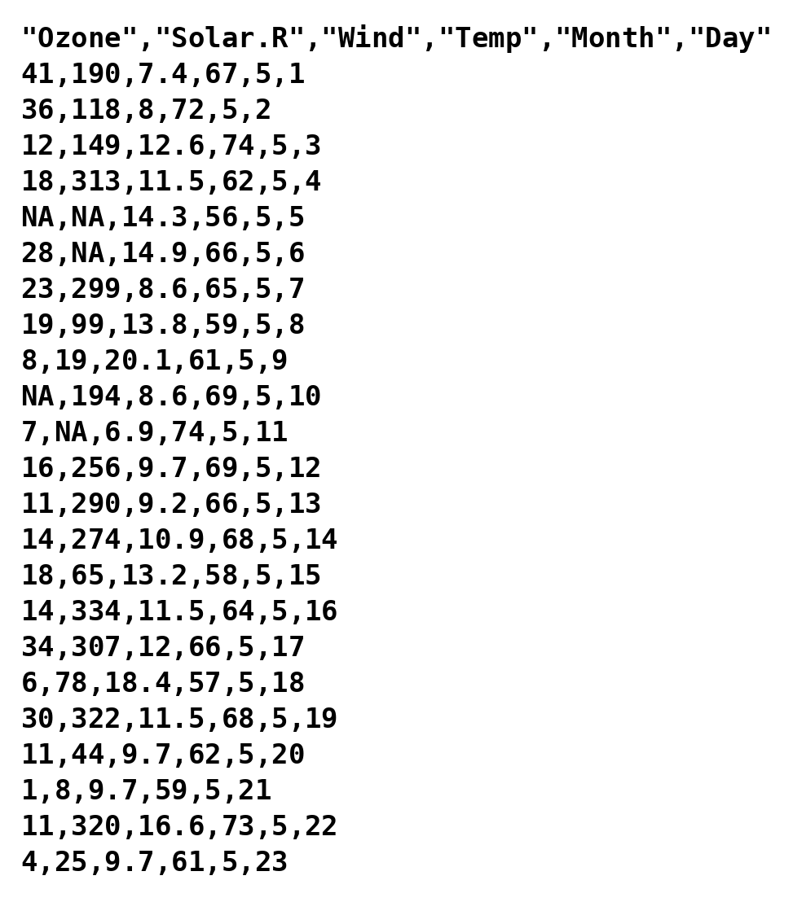

## [Homepage](index.html)

```{r}
#| warning: false
#| echo: false
#| include: false
#| message: false
#| purl: false

# Please ignore this chunk.
# A single purl() call: calling it twice in the same knit would clash on the
# chunk labels. The clean script is derived from the full one, so the two
# cannot go out of sync.

# 1. Full script, for personal use: code plus the text of the notes as
#    comments. Not linked from the website (and ignored by git).
knitr::purl("un_C.qmd", output = "code/un_C_full.R", documentation = 2)
full <- readLines("code/un_C_full.R")
# strip the Quarto markup that is only meaningful in the rendered page
full <- full[!grepl("^#' *:::", full)]
full <- gsub("\\[([^]]*)\\]\\{[^}]*\\}", "\\1", full)
squeeze <- function(x) x[!(x == "" & c(FALSE, head(x == "", -1)))]
writeLines(squeeze(full), "code/un_C_full.R")

# 2. Clean script, linked from the website: code only, obtained by dropping
#    the text (#') and the chunk headers (#+).
clean <- squeeze(full[!grepl("^#'|^#\\+", full)])
writeLines(clean, "code/un_C.R")
styler:::style_file("code/un_C.R")
```

## Unit C

-   The `data.frame` object
-   Importing a dataset into memory
-   Exploring and manipulating a dataset
-   Types of variables
-   Missing values

::: callout-note
#### Note

The exercises associated with this unit are available at
[this link](https://tommasorigon.github.io/EnvEcoStat/exe/exe_A.html).
:::

## Objects of type `data.frame`

An **R** object called `data.frame` corresponds to the [data matrix]{.orange}.

Each row therefore represents a [statistical unit]{.blue}, whereas each column
represents a [variable]{.orange}.

A `data.frame` looks like a matrix (`matrix`), but it is meant for data
analysis.

For example, a `data.frame` can also contain non-numerical values, such as
[qualitative variables]{.blue} or [missing values]{.orange}.

As we will see, the `data.frame` is generally loaded into **R** using, for
instance, the function `read.table`.

## Importing a dataset

The most frequent way of loading a dataset into memory is to import it from an
[external file]{.blue}.

If the data are of small / medium size (file size $<$ 3-4 Gb), they are often
saved in `.csv` or `.txt` format.

In real and more complex settings, it is possible to import the data directly
from relational databases such as [SQL]{.orange}.

It is not advisable to import data into **R** from an Excel file. More
generally, there are several reasons to avoid Excel if the goal is to carry out
a rigorous data analysis.

::: callout-note
#### Note

To be able to run the next commands, you need to download the file
`airquality.csv` and save it on your computer.
[Link to the file](data/airquality.csv).
:::

## The raw data (text editor)



## The working directory

The active **R** session is open in a specific [working directory]{.orange}, identified
by the command `getwd`.

For example, the directory in which this code was executed is the following

```{r}
getwd() # Identifies the working directory (get working directory)
```

To open the file `airquality.csv`, you must provide **R** with the **path of the
file**, which depends on where it has been saved (on the Desktop, in the
downloads folder, and so on).

```{r}
# THE PATH VARIABLE MUST BE CHANGED DEPENDING ON WHERE THE .csv FILE IS SAVED
path <- "data/airquality.csv" # This is the path of the file, relative to getwd()
```

The path of the file can also be a [link]{.blue}, as in this case:

```{r}
#| eval: false
path <- "https://tommasorigon.github.io/EnvEcoStat/data/airquality.csv"
```

## Importing the dataset

It is also possible to [change the working directory]{.orange} through the command
`setwd`.

In RStudio, you can use the option *More -\> Set as working directory* in the
*Files* window, selecting the directory of interest.

Once the correct *path* of the file has been identified, to **import the
dataset** into memory one uses, for instance, the command `read.table`.
Therefore:

```{r}
airquality <- read.table(path, header = TRUE, sep = ",")
```

::: callout-note
#### Note

-   The option `header = TRUE` means that the first row contains the names of
    the variables.
-   The option `sep = ","` indicates that the values of each variable are
    separated by a comma.
:::

Finally, note that if the file is contained in the working directory, it is then
enough to use:

```{r}
#| eval: false
airquality <- read.table("airquality.csv", header = TRUE, sep = ",")
```

## Exploring a `data.frame`

First of all, we are interested in understanding how many [variables]{.blue} and how
many [observations]{.orange} are contained in the `data.frame`:

```{r}
dim(airquality) # Equivalent to c(nrow(airquality), ncol(airquality))
```

To check that we have not made gross mistakes in importing the `data.frame`, we
can display the first $6$ observations with the command `head`:

```{r}
head(airquality) # Equivalent command: airquality[1:6, ]
```

The command `tail` can be used to show the last $6$ observations:

```{r}
tail(airquality) # Equivalent command: airquality[148:153, ]
```

## The `airquality` dataset

The `airquality` dataset therefore contains a total of $6$ variables. Each
observation is a [day]{.blue} between 1 May and 30 September [1973]{.orange}, and the
measurements were collected in [New York]{.blue}.

-   The variable `Ozone` is the mean ozone concentration, in parts per billion.
-   The variable `Solar.R` is the solar radiation, in Langleys.
-   The variable `Wind` is the average wind speed, in miles per hour.
-   The variable `Temp` is the maximum daily temperature, in degrees Fahrenheit.
-   The variables `Month` and `Day` identify the calendar day.

To [access]{.orange} and [modify]{.blue} the names of the variables, one uses the command
`colnames`.

```{r}
colnames(airquality) # To access the names of the variables
```

## Types of variables

A dataset contains different [types of variables]{.orange}.

Discrete and continuous quantitative variables are coded in **R** as objects of
type `integer` and `numeric`, respectively.

Qualitative variables are coded in **R** as objects of type `character` or of
type `factor`; the difference between these types will be clarified in the next
sections.

Finally, dates are coded in **R** with the type `Date`.

::: callout-note
#### Note

**R** does not always recognise the type of the variables correctly, as
highlighted by the command `str`, which provides a summary of the `data.frame`.

```{r}
str(airquality)
```

Here `Month` and `Day` are read as `integer`, but they are calendar codes rather
than quantities: we will convert them below.
:::

## Quantitative variables

To [extract a variable]{.blue} from a `data.frame` one proceeds as in the case of
lists, that is through the symbol `$`. The variables can be saved under any
name.

A numerical variable is an **R** vector to all intents and purposes, therefore
we can apply the functions we have already met so far

```{r}
is.numeric(airquality$Wind) # Check that it is a variable of type numeric
class(airquality$Wind)
airquality$Wind[1:10] # First 10 elements of an R vector
```

The symbol `$` is also used to [create a new variable]{.orange}. The temperature
is expressed in degrees Fahrenheit, which is not the most convenient scale for
us; recalling that

$$
(\text{``Fahrenheit''}) = 32 + \frac{9}{5}(\text{``Celsius''}),
$$

we add to the `data.frame` a column with the temperature in degrees Celsius:

```{r}
airquality$TempC <- (airquality$Temp - 32) * 5 / 9

head(airquality[, c("Temp", "TempC")]) # The two scales side by side
```

Note that the operation is [vectorised]{.blue}: it is applied to all $153$ days
at once, without any loop.

```{r}
range(airquality$Temp) # In degrees Fahrenheit
range(airquality$TempC) # In degrees Celsius
```

The [descriptive analyses]{.orange} of a numerical variable will be addressed in the
next units; for now we limit ourselves to the manipulation of the `data.frame`.

## Variables of type `date`

The variables `Month` and `Day` identify a date, and it is convenient to store
that date as such. All the observations refer to the year $1973$.

In **R** the conversion is performed by the command `as.Date`, followed by the
[format]{.blue} in which the date is expressed:

```{r}
dates <- paste(1973, airquality$Month, airquality$Day, sep = "-")
dates[1:3] # Character strings of the form "1973-5-1"

airquality$Date <- as.Date(dates, format = "%Y-%m-%d")
class(airquality$Date)
airquality$Date[1:10]
```

Once converted into `Date` format, it is possible to carry out some additional
operations. For example:

```{r}
min(airquality$Date) # First day of the series
max(airquality$Date) # Last day of the series
```

::: callout-warning
We build the date [before]{.orange} converting `Month` into a qualitative variable. If
we did the opposite, the numerical code of the month would no longer be
available to `paste`.
:::

## Qualitative variables I

Variables of type `character` are appropriate for text strings, that is when
each field corresponds to a short text, such as a *Tweet*.

Qualitative variables with repeated values should instead be coded as `factor`.
This is the case of `Month`: the numbers from $5$ to $9$ are [labels]{.blue}, not
quantities, and computing their mean would make no sense.

We therefore [convert]{.orange} the variable as follows:

```{r}
airquality$Month <- factor(airquality$Month)
class(airquality$Month)
```

::: callout-note
#### Note

This file contains no text column. When a file does contain one, the conversion
can be performed directly while reading the data, through the option
`stringsAsFactors = TRUE` of `read.table`.
:::

## Qualitative variables II

In variables of type `factor` the various [categories]{.blue} are listed, called
`levels` in **R**.

To access the categories one uses the command `levels`, which lists the
categories of the variable in increasing order:

```{r}
levels(airquality$Month)
table(airquality$Month) # Number of days observed in each month
```

## Qualitative variables III

The command `levels` makes it possible to [rename the categories]{.orange}, for
example:

```{r}
airquality$Month[1:10]
levels(airquality$Month) <- c("May", "June", "July", "August", "September")
airquality$Month[1:10]
```

The command `levels` also makes it possible to [merge]{.blue} the categories of a
qualitative variable:

```{r}
airquality$Season <- airquality$Month # Create a copy of Month called Season
# June, July and August are the peak months for ozone: merge them
levels(airquality$Season) <- c("Off-peak", "Peak", "Peak", "Peak", "Off-peak")

table(airquality$Season)
```

## Manipulating a dataset

To [select the rows]{.orange} of a dataset one proceeds as in the case of matrices:

```{r}
airquality[c(120, 62, 9), ]
```

It is of course possible (and typically much more useful) to select the
observations that satisfy a given [condition]{.blue}.

Suppose for example that we want to identify the hottest days, those above $90$
degrees Fahrenheit:

```{r}
airquality_hot <- airquality[airquality$Temp > 90, ]
dim(airquality_hot)
head(airquality_hot)
```

## Missing values

Suppose now that we want to identify the days on which the ozone concentration
exceeded $100$ parts per billion:

```{r}
airquality_ozone <- airquality[airquality$Ozone > 100, ]
dim(airquality_ozone)
head(airquality_ozone)
```

::: callout-important
Something went wrong: there are rows entirely made of symbols (`NA`) that we had
not met so far.
:::

The reason why the command produces apparently strange results is due to the
presence of some [missing data]{.orange}, coded as `NA` (*Not Available*).

The comparison `NA > 100` does not return `TRUE` or `FALSE`: it returns `NA`,
because the value is unknown. Consequently the selection returns one row for
every missing value.

```{r}
sum(is.na(airquality$Ozone)) # How many days lack the ozone measurement
colSums(is.na(airquality)) # The same count, variable by variable
```

The function `is.na` produces a [logical]{.blue} matrix of the same dimension as
`airquality`, containing `TRUE` if the value is missing and `FALSE` otherwise.

The function `rowSums(matrix)` produces a vector whose values are the sum of the
elements of each row of the `matrix`.

As a consequence, `rowSums(is.na(airquality))` indicates how many missing values
are present in each row.

```{r}
sum(rowSums(is.na(airquality)) > 0) # Number of incomplete days
```

## Handling missing data

The statistical treatment of missing data is not among the objectives of this
course.

The easiest solution, although a potentially very dangerous one, consists simply
in [removing]{.orange} the incomplete rows through the command `na.omit`:

```{r}
airquality_no_na <- na.omit(airquality)
dim(airquality_no_na)
```

::: callout-warning
We started from $153$ days and we are left with $111$: more than a quarter of
the data has been thrown away. Moreover the missing values are [not]{.blue} spread
evenly over the months, so what remains is not a fair picture of the summer.
:::

To solve the original problem, that is identifying the days with a high ozone
concentration, one can use `subset`, which discards the missing values:

```{r}
airquality_ozone <- subset(airquality, subset = Ozone > 100)
airquality_ozone
```

## Selecting the variables

The command `subset` can be used both to [select the rows]{.orange} (observations) and
to [select the columns]{.blue} (variables).

In the second case, one can proceed through the option `select`:

```{r}
airquality_pollution <- subset(airquality, select = c(Date, Ozone, Temp, Wind))
head(airquality_pollution)
```

Of course it is also possible to select [simultaneously]{.orange} both the rows and the
columns.

```{r}
subset(airquality, subset = Ozone > 100, select = c(Date, Ozone, Temp))
```

## The `attach` command

In **R** there exists a command called `attach`. Although used by many, this
command is [diabolical]{.blue} and it would be better to avoid using it.

The command `attach(dataframe)` makes it possible to use the variables of a
`data.frame` as if they were present in the workspace.

This practice, however, makes the code much less readable and often leads to
errors of various kinds.

Despite several protests in favour of the removal of `attach` by some, this
command keeps (r)existing and is still used by many.

In this course no examples of use of `attach` will be provided, to avoid leading
the student into temptation.

## Summary

After all these operations, the dataset turns out to be much modified with
respect to its initial version.

Running the command `str` again we indeed obtain that

```{r}
str(airquality)
```

## Summary exercise

Ozone is not emitted directly: it forms in the lower atmosphere through
reactions that are favoured by [sunlight]{.orange} and [heat]{.blue}, and it is dispersed by
the [wind]{.orange}. The following questions are a first, purely descriptive look at
that mechanism.

-   On which day was the highest ozone concentration recorded? And the highest
    temperature? Are they the same day?

-   How many days are missing the ozone measurement, month by month? Is the
    problem spread evenly over the summer?

-   Compute the average ozone concentration in each month. Be careful: the
    command `mean` returns `NA` if even a single value is missing.

-   Create a qualitative variable `Windy` that distinguishes the days with a
    wind speed above the median from the others. Then compare the average ozone
    concentration of the two groups. Is the result consistent with what was said
    above?

::: callout-tip
#### Hint

Use the commands `which.max`, `table` and `tapply`. The option `na.rm = TRUE` of
the command `mean` excludes the missing values from the computation. Consult the
documentation to understand how they work.
:::

#### Solution

```{r}
# Day of the maximum ozone concentration, and of the maximum temperature
airquality[which.max(airquality$Ozone), ]
airquality[which.max(airquality$Temp), ]

# Missing ozone measurements, month by month
table(airquality$Month[is.na(airquality$Ozone)])

# Average ozone concentration in each month
tapply(airquality$Ozone, airquality$Month, mean, na.rm = TRUE)

# Windy days and average ozone concentration
airquality$Windy <- factor(airquality$Wind > median(airquality$Wind),
  levels = c(FALSE, TRUE), labels = c("Calm", "Windy")
)
tapply(airquality$Ozone, airquality$Windy, mean, na.rm = TRUE)
```
