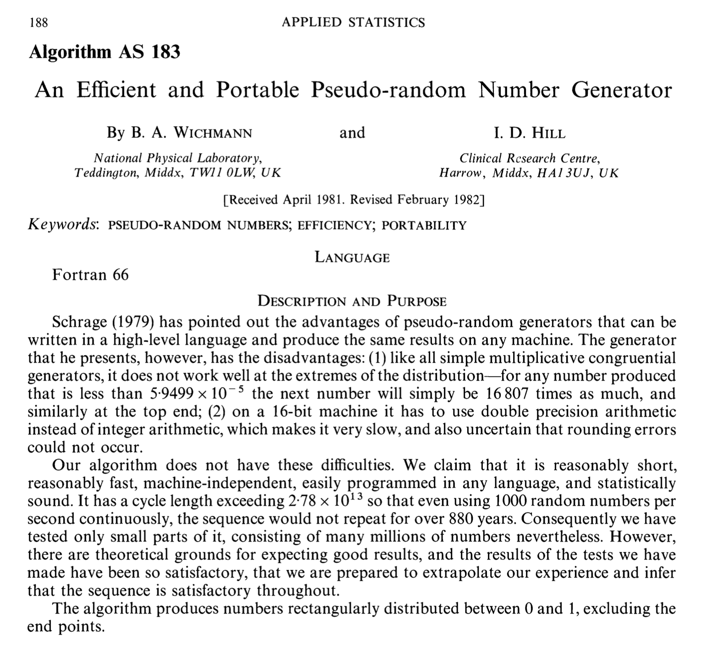

## [Homepage](index.html)

```{r}
#| warning: false
#| echo: false
#| include: false
#| message: false
#| purl: false

# Please ignore this chunk.
# A single purl() call: calling it twice in the same knit would clash on the
# chunk labels. The clean script is derived from the full one, so the two
# cannot go out of sync.

# 1. Full script, for personal use: code plus the text of the notes as
#    comments. Not linked from the website (and ignored by git).
knitr::purl("un_H.qmd", output = "code/un_H_full.R", documentation = 2)
full <- readLines("code/un_H_full.R")
# strip the Quarto markup that is only meaningful in the rendered page
full <- full[!grepl("^#' *:::", full)]
full <- gsub("\\[([^]]*)\\]\\{[^}]*\\}", "\\1", full)
squeeze <- function(x) x[!(x == "" & c(FALSE, head(x == "", -1)))]
writeLines(squeeze(full), "code/un_H_full.R")

# 2. Clean script, linked from the website: code only, obtained by dropping
#    the text (#') and the chunk headers (#+).
clean <- squeeze(full[!grepl("^#'|^#\\+", full)])
writeLines(clean, "code/un_H.R")
styler:::style_file("code/un_H.R")

rm(clean, squeeze, full)
```

## Topics covered

-   Discrete random variables
-   Continuous random variables
-   Simulation of (pseudo) random values

## Random variables (recap)

The [formal definition]{.orange} of a [random variable]{.blue} involves concepts from
measure theory ($\sigma$-algebras, probability measures, and so on), which we
will leave in the background.

For the purposes of this course, it is enough to recall that a real-valued
random variable $X$ is uniquely identified by its **cumulative distribution
function**, that is $$
F(x) := \mathbb{P}(X \le x).
$$

If the function $F(x)$ is piecewise constant, we say that $X$ is a [discrete]{.orange}
random variable.

If the function $F(x)$ is continuous, we say that $X$ is a [continuous]{.blue} random
variable.

::: callout-tip
#### Hint

In case you do not remember the definition of a random variable, it is a good
idea to go back to the textbook and to your notes on probability.
:::

## Discrete random variables I (recap)

As anticipated, a random variable is said to be discrete if $F(x)$ is piecewise
constant.

More precisely, we say that $X$ is a discrete random variable if there exists a
set of [countable cardinality]{.orange} $\mathcal{S} \subseteq \mathbb{R}$, called the
[support]{.blue}, such that $$
\mathbb{P}(X \in \mathcal{S}) = \sum_{x \in \mathcal{S}} \mathbb{P}(X = x) = 1.
$$

In practice, we will often have that the support
$\mathcal{S} \subseteq \{0, 1, 2, \dots\}$ is a subset of the natural numbers.
Moreover, the support $\mathcal{S}$ can be [finite]{.orange}.

Intuitively, we say that the random variable $X$ can only take the values in the
support $\mathcal{S}$.

## Discrete random variables II (recap)

The [probability mass function]{.blue} of a discrete random variable is equal to $$
p(x) = \mathbb{P}(X = x).
$$

The function $p(x)$ [identifies]{.orange} a discrete random variable.

Therefore, of course, it holds that $p(x) \ge 0$ and that
$\sum_{x \in \mathcal{S}} p(x) = 1$.

The [expected value]{.blue} of a random variable is moreover defined, if it exists,
as $$
\mathbb{E}(X) = \sum_{x \in \mathcal{S}} x \: p(x). 
$$

More generally, the expected value of a transformation $g(X)$, if it exists, is
equal to $$
\mathbb{E}\{g(X)\} = \sum_{x \in \mathcal{S}} g(x) \: p(x).
$$

## Binomial distribution (probability mass function)

Let $X \sim \text{Bin}(n, \pi)$ be a [binomial]{.orange} random variable, so that the
probability mass function is $$
\mathbb{P}(X = k) = {n \choose k } \pi^k (1-\pi)^{n-k}, \qquad k=0,1,\dots,n.
$$

Supposing that $n = 10$ and $\pi = 0.6$, then $\mathbb{P}(X=4)$ is computed as
follows:

```{r}
n <- 10 # Number of trials
p <- 0.6 # Probability of success
k <- 4 # Number of successes

choose(n, k) * p^k * (1 - p)^(n - k)
```

However, in **R** there is a dedicated function to compute the probability mass
function:

```{r}
dbinom(k, size = n, prob = p)
```

## Binomial distribution (cumulative distribution function)

In a similar way, we can also compute the following probability, that is

$$
F(x) =   \mathbb{P}(X \le x) = \sum_{k=0}^x\mathbb{P}(X = k), \qquad X \sim \text{Bin}(n, \pi).
$$

Supposing that $n = 10$ and $\pi = 0.6$, then the value $F(5)$ is computed as
follows:

```{r}
sum(dbinom(0:5, size = n, prob = p))
pbinom(5, size = n, prob = p) # Specific R function
```

Suppose instead that we are interested in the complementary event, that is: $$
\mathbb{P}(X > 5) = 1 - \mathbb{P}(X \le 5).
$$

```{r}
1 - pbinom(5, size = n, prob = p)
pbinom(5, size = n, prob = p, lower.tail = FALSE)
```

## Binomial distribution (expected value)

The [expected value]{.blue} of a binomial random variable is equal to

$$
\mathbb{E}(X) = \sum_{k=0}^n k \: \mathbb{P}(X = k) =  n\pi, \qquad X \sim \text{Bin}(n,\pi).
$$

Supposing as before that $n = 10$ and $\pi = 0.6$, we have that:

```{r}
n * p # Expected value obtained through analytical computations
sum(0:n * dbinom(0:n, size = n, prob = 0.6)) # Numerical computation
```

Through direct computation, we can moreover evaluate for example
$\mathbb{E}(\sqrt{X})$, indeed:

```{r}
sum(sqrt(0:n) * dbinom(0:n, size = n, prob = 0.6))
```

::: callout-note
#### Note

The computation of the expected value is "easy" when the support of the discrete
distribution is finite.
:::

## Binomial distribution (quantiles)

The [$p$-quantile]{.orange} of a discrete distribution is the smallest value $k$ such
that $\mathbb{P}(X \le k) \ge p$. Hence: $$
\mathcal{Q}(p) = \inf\{x \in \mathbb{R} : F(x) \ge p \}.
$$

Supposing that $X \sim \text{Bin}(10, 0.6)$, the [first quartile]{.blue} for example
is

$$
\mathcal{Q}(0.25) = \inf\{x \in \mathbb{R} : F(x) \ge 0.25 \} = 5.
$$

In **R** we can obtain these results as follows:

```{r}
qbinom(0.25, size = 10, prob = 0.6) # First quartile
```

Indeed, it holds that:

```{r}
pbinom(4, size = 10, prob = 0.6) # The value is smaller than 0.25
pbinom(5, size = 10, prob = 0.6) # The value is larger than 0.25
```

## Binomial distribution (graphical representation)

```{r}
kk <- 0:n
prob <- dbinom(0:n, size = n, prob = p)
plot(kk, prob, type = "h", main = "Bin(10,0.6)", xlab = "k", ylab = "P(X=k)")
```

## Continuous random variables I (recap)

A random variable is said to be [continuous]{.orange} if $F(x)$ is continuous.

The [density]{.blue} function of a continuous random variable is a function
$f(x) \ge 0$ such that $$
\mathbb{P}(a < X < b) = \int_a^b f(x) \mathrm{d} x, \qquad f(x) = \frac{\partial}{\partial x} F(x). 
$$

Therefore, by definition: $$
\mathbb{P}(X \le b) = F(b) = \int_{-\infty}^b f(x) \mathrm{d} x.
$$

Moreover, the [expected value]{.orange} of a transformation $g(X)$, if it exists, is
equal to $$
\mathbb{E}\{g(X)\} = \int_{\mathbb{R}} g(x) \: f(x) \mathrm{d} x.
$$

## Normal distribution (density function)

Let $X \sim \text{N}(\mu, \sigma^2)$ be a [Gaussian variable]{.blue} with mean $\mu$
and variance $\sigma^2$, that is having density $$
f(x) = \frac{1}{\sqrt{2 \pi \sigma^2}}\exp\left\{-\frac{1}{2\sigma^2}(x - \mu)^2\right\}.
$$

If $X \sim \text{N}(3, 10)$ then we can compute the value $f(1)$ using the **R**
commands:

```{r}
x <- 1 # Point at which to compute f(x)
mu <- 3 # Mean
sigma2 <- 10 # Variance

1 / sqrt(2 * pi * sigma2) * exp(-1 / (2 * sigma2) * (x - mu)^2)
dnorm(x, mean = 3, sd = sqrt(sigma2))
```

::: callout-note
#### Note

The command `dnorm` takes as an argument the standard deviation $\sigma$, not
the variance $\sigma^2$.
:::

## Normal distribution (cumulative distribution function)

Let $X \sim \text{N}(0,1)$ be a [standard normal]{.orange}. We are interested in
computing the probability of the following event: $$
\mathbb{P}(|X| \le 1) = \mathbb{P}(-1 \le X \le 1) = \mathbb{P}(X \le 1) - \mathbb{P}(X < -1).
$$

We can compute this probability (in an inefficient way) through the command
`integrate`, therefore:

```{r}
integrate(dnorm, lower = -1, upper = 1)
```

Since we are dealing with a continuous variable, we obtain that
$\mathbb{P}(X < -1) = \mathbb{P}(X \le -1)$.

Hence, we can compute this probability in **R** using the dedicated commands:

```{r}
pnorm(1) - pnorm(-1)
```

## Normal distribution (quantile function)

The continuity of the cumulative distribution function $F(x)$ implies that the
[quantile function]{.blue} is equal to $\mathcal{Q}(\cdot) = F^{-1}(\cdot)$.

For example, consider the third quartile of a standard normal distribution, that
is

```{r}
qnorm(0.75)
```

As a consequence, the quantile and the cumulative distribution functions are
such that $$
F(\mathcal{Q}(0.75)) = F(F^{-1}(0.75))= 0.75.
$$

Indeed:

```{r}
pnorm(qnorm(0.75))
```

## Normal distribution (graphical representation)

```{r}
curve(dnorm(x, mean = 0, sd = 1), from = -3, to = 3, ylab = "f(x)", main = "N(0,1)")
```

## Summary table I

**R** has an extensive [collection of functions]{.orange} dedicated to the main
probability distributions. Let $X$ be a random variable.

-   `ddist` (where the initial `d` stands for [density]{.blue}). Computes the
    [density]{.orange} $f(x)$ of a continuous variable $X$, or the probability mass
    function $p(x) = \mathbb{P}(X = x)$ in case $X$ is discrete.

-   `pdist` (where the initial `p` stands for [probability]{.blue}), which makes it
    possible to compute the value of the [cumulative distribution function]{.orange} at
    a specified point, that is it computes $F(x) = \mathbb{P}(X \le x)$.

-   `qdist` (where the initial `q` stands for [quantile]{.blue}), which represents
    the [quantile function]{.orange}, that is: $$
    \mathcal{Q}(p) = \inf\{x \in \mathbb{R} : F(x) \ge p\}, \qquad p \in (0,1).
    $$

-   `rdist` (where the initial `r` stands for [random]{.blue}), which makes it
    possible to generate [pseudo-random]{.orange} numbers, illustrated below.

## Summary table II

| Distribution | Command | Parameters      | Default  |
|--------------|---------|-----------------|----------|
| Binomial     | `binom` | `size`, `prob`  | \-       |
| Geometric    | `geom`  | `prob`          | \-       |
| Poisson      | `pois`  | `lambda`        | \-       |
| Uniform      | `unif`  | `min`, `max`    | `0`, `1` |
| Gamma        | `gamma` | `shape`, `rate` | -, `1`   |
| Exponential  | `exp`   | `rate`          | `1`      |
| Chi-squared  | `chisq` | `df`            | \-       |
| Normal       | `norm`  | `mean`, `sd`    | `0`, `1` |

::: callout-caution
Be careful with the parametrisations and with the meaning of the arguments.
Consult the documentation to know how they are defined.
:::

::: callout-note
#### Exercise

Represent graphically all the previous distributions, for different choices of
the parameters.
:::

## Pseudo-random numbers I

The fourth class of functions in our list is the one of type `rdist`, which
makes it possible to obtain [random values]{.blue} from a distribution.

For example, to sample $5$ independent and identically distributed (iid) values
from a standard normal, that is $$
X_i \overset{\text{iid}}{\sim} \text{N}(0,1), \qquad i=1,\dots,5
$$ we can use in **R** the following command:

```{r}
R <- 5
rnorm(R, mean = 0, sd = 1)
```

## Pseudo-random numbers II

The values generated by the command `rdist` imitate the results of a random
process, but they are in fact [deterministic]{.orange}. Such values are therefore
called [pseudo-random]{.blue}.

There actually exist methods to generate [truly random]{.orange} numbers, based for
instance on atmospheric measurements.

At the website <https://www.random.org/gaussian-distributions/> it is possible
to obtain a limited number of random values from a Gaussian distribution.

The disadvantage of this latter class of methods is that they are relatively
[expensive]{.blue} to obtain $\implies$ is it worth it?

Unless there are specific security concerns, pseudo-random numbers are the
[standard]{.orange} used by almost all users.

<!-- ## Pseudo-random numbers in $(0,1)$ -->

<!-- Suppose we know how to simulate values $U_1,\dots,U_n$ from a **uniform -->
<!-- distribution** on $(0,1)$, that is what one obtains for instance through the -->
<!-- command `runif`. -->

<!-- We can "easily" obtain random values from any distribution by considering a -->
<!-- suitable transformation of the values $U_1,\dots,U_n$. -->

<!-- The [hard part]{.blue} is therefore to simulate pseudo-random values $U_1,\dots,U_n$ -->
<!-- in such a way that they resemble as closely as possible iid realisations from a -->
<!-- uniform distribution. -->

<!-- Since we are dealing with pseudo-random numbers, we are therefore looking for an -->
<!-- actual [algorithm]{.orange} that, starting from some initial conditions, produces -->
<!-- $U_1,\dots,U_n$. -->

<!-- The initial condition is typically called the [seed]{.blue}. -->

<!-- ## Pseudo-random numbers in $(0,1)$ -->

<!-- We present a very simple method to generate pseudo-random numbers -->
<!-- [@Wichmann1982], which was nevertheless very popular in the 1980s and 1990s. -->

<!--  -->

<!-- ## The Wichmann & Hill algorithm -->

<!-- We want to obtain realisations $u_1,\dots, u_n$ from a uniform distribution on -->
<!-- $(0,1)$. -->

<!-- -   [Initialisation]{.orange}. One starts from any three integer numbers -->
<!--     $x_0, y_0, z_0$, which constitute the initial condition, the so-called -->
<!--     [seed]{.blue}. -->

<!-- -   [Iterative update]{.orange} of the seed. At each iteration, the $3$ numbers -->
<!--     $x_i, y_i, z_i$ are updated starting from those obtained at the previous -->
<!--     iteration: $$ -->
<!--       \begin{aligned} -->
<!--       x_i = (171 \times x_{i-1})(\text{mod}\:30269) \\ -->
<!--       y_i = (172 \times y_{i-1})(\text{mod}\:30307) \\ -->
<!--       z_i = (170 \times z_{i-1})(\text{mod}\:30323) \\ -->
<!--       \end{aligned} -->
<!--     $$ for every $i=1,\dots,n$. The function $\text{mod}$ (equivalent to `%%` in -->
<!--     **R**) computes the [remainder]{.blue}, so that for example -->
<!--     $205 (\text{mod}\:10) = 5$. -->

<!-- -   [Output]{.orange}. One obtains a sequence of realisations as follows: $$ -->
<!--     u_i = \left(\frac{x_i}{30269} + \frac{y_i}{30307} + \frac{z_i}{30323} \right)(\text{mod}\: 1), \qquad i=1,\dots,n. -->
<!--     $$ -->

<!-- ## The Wichmann & Hill algorithm -->

<!-- The algorithm therefore updates the initial condition (`seed`) [iteratively]{.blue}. -->
<!-- The final values $x_n, y_n, z_n$ can be used as the `seed` for subsequent draws. -->

<!-- There is nothing "random" in this sequence of numbers. By definition, if the -->
<!-- three starting numbers $x_0, y_0, z_0$ are the same, the output will always be -->
<!-- the same. -->

<!-- This algorithm has a [period]{.orange} approximately equal to -->
<!-- $m = 6.95 \times 10^{12}$. Therefore $$ -->
<!-- u_{i + m} = u_i. -->
<!-- $$ -->

<!-- Hence, if we ran this method for a sufficiently long time, the sequence of -->
<!-- numbers obtained is bound to repeat itself! -->

<!-- Is a repeating sequence a problem? In theory yes; in practice $m$ in modern -->
<!-- algorithms ($m \approx 2^{19937}$) is so large that this factor is negligible. -->

<!-- ::: callout-note -->
<!-- #### Note -->

<!-- The sequence obtained should be [tested]{.blue} to check that it does indeed "look" -->
<!-- random and uniform on $(0,1)$. -->
<!-- ::: -->

<!-- ## The Wichmann & Hill algorithm -->

<!-- ```{r} -->
<!-- runif.wh <- function(n) { -->
<!--   a <- c(171, 172, 170) -->
<!--   b <- c(30269, 30307, 30323) -->
<!--   s <- .current.seed # The current seed lives in the "global environment" -->
<!--   u <- rep(0, n) # Initialisation of the output -->
<!--   for (i in 1:n) { -->
<!--     s <- (a * s) %% b -->
<!--     u[i] <- sum(s / b) %% 1 -->
<!--   } -->
<!--   .current.seed <<- s # Saves the final seed in the "global environment" -->
<!--   u -->
<!-- } -->

<!-- .current.seed <- c(123, 456, 789) -->
<!-- runif.wh(5) -->

<!-- .current.seed -->
<!-- ``` -->

<!-- ## Simulation of discrete variables -->

<!-- Suppose we want to draw iid values $X_1,\dots,X_n$ from a [discrete law]{.orange}. -->

<!-- For simplicity, let us assume that the support -->
<!-- $\mathcal{S} = \{x_1, \dots, x_K\}$ is finite and that $(\pi_1,\dots,\pi_K)$ are -->
<!-- the associated probabilities, so that $$ -->
<!-- \mathbb{P}(X_i = x_k) = \pi_k, \qquad k=1,\dots,K.  -->
<!-- $$ -->

<!-- Starting from the uniform variables $U_1,\dots,U_n$ on $(0,1)$ it is easy to -->
<!-- obtain $X_1,\dots,X_n$. -->

<!-- We split the interval $(0,1)$ into $K$ sub-intervals, each of length $\pi_k$. -->
<!-- The value $X_i$ corresponds to the value associated with the interval to which -->
<!-- $U_i$ belongs. -->

<!-- Indeed, let $a_0 = 0$ and $(a_{k-1}, a_k)$ be the $k$-th interval such that -->
<!-- $a_k - a_{k-1} = \pi_k$. Then $$ -->
<!-- \mathbb{P}(a_{k-1} < U_i < a_k) = \pi_k \implies \mathbb{P}(X_i = x_k) = \pi_k, -->
<!-- $$ for $k=1,\dots,K$. -->

<!-- ## Example: the binomial distribution -->

<!-- We can exploit our function `runif.wh` to obtain pseudo-random values from a -->
<!-- binomial distribution. -->

<!-- ```{r} -->
<!-- rbinom.wh <- function(n, size, prob) { -->
<!--   u <- runif.wh(n) -->
<!--   probs <- dbinom(0:size, size = size, prob = prob) -->
<!--   breaks <- cumsum(c(0, probs)) -->
<!--   as.numeric(cut(u, breaks)) - 1 # Converts the "factor" variable into integers -->
<!-- } -->

<!-- .current.seed <- c(100, 200, 300) -->
<!-- rbinom.wh(20, size = 5, prob = 0.5) -->
<!-- ``` -->

<!-- ::: callout-note -->
<!-- #### Note -->

<!-- This code is reported for teaching purposes only. In practice, there exist -->
<!-- smarter (and much faster!) ways to obtain this result. -->
<!-- ::: -->

## Example: the roll of a six-sided die

A [six-sided die]{.blue} represents a discrete random variable $X$ with probability
mass function called [Discrete Uniform]{.orange}, that is

$$
\mathbb{P}(X = k) = \frac{1}{6}, \qquad k=1,\dots,6.
$$

To simulate the roll of a six-sided die, we first build a vector containing a
[sequence of numbers]{.blue} from 1 to 6 corresponding to the possible outcomes of
the roll.

```{r}
dice <- 1:6
```

We can use the command `sample` to perform the roll:

```{r}
set.seed(123) # R command to fix the "seed"
sample(x = dice, size = 1) # size = 1 implies that a single die is rolled
```

::: callout-note
#### Note

The command `set.seed(number)` is the command that makes it possible to fix the
seed in **R**.
:::

## The `sample` command

More generally, the function `sample(x, size, replace, prob)` randomly draws a
number `size` of elements from an [urn]{.orange} containing the objects `x`

-   with replacement, if `replace = TRUE`;
-   without replacement, if `replace = FALSE`.

If the argument `prob` is not specified, the function `sample` assigns equal
probability to every element of `x`.

If we wanted to sample with [non-uniform probabilities]{.blue}, we would have to
provide a vector of probabilities of length equal to the number of elements of
`x` (try it as an exercise!)

## Sampling with replacement

Sampling with replacement is equivalent to making $n$ independent draws from the
same random variable $X$. Therefore, to roll the same die $10$ times:

```{r}
set.seed(140)
n <- 10
# replace = TRUE implies that the die is rolled 10 times
sim <- sample(dice, size = n, replace = TRUE)
sim
```

## Sampling without replacement

To perform a hypothetical lottery draw, one has to draw from an urn 5 numbers,
between 1 and 90, [without replacement]{.orange}.

In **R** therefore:

```{r}
sample(1:90, size = 5, replace = FALSE)
```

If we only specify the following command:

```{r}
sample(dice)
```

we obtain a random [permutation]{.blue} of the elements of `x`.

Indeed, the default values are `replace = FALSE` and `size = length(x)`, that is
a sampling [without replacement]{.orange} of all the elements of the urn.

## Summary exercise

The commands of the `d`, `p`, `q` and `r` families can be combined to check
*graphically* that a simulated sample really does follow the distribution it is
supposed to follow. This is the idea behind this exercise.

#### Discrete case

1.  Simulate $n = 1000$ values from a $\text{Bin}(10, 0.3)$ and compute the
    [relative frequencies]{.orange} of each outcome $k = 0,1,\dots,10$.

2.  Draw the probability mass function with `plot(..., type = "h")`, as we did
    above, and superimpose the relative frequencies. Do the two agree?

::: callout-tip
#### Hint

`table(y)` does not return the outcomes that never occurred. Use
`table(factor(y, levels = 0:10))` to obtain a table of length $11$ in any case.
:::

#### Continuous case

3.  Simulate $n = 1000$ values from an exponential distribution with rate
    $\lambda = 0.5$.

4.  Draw the [histogram]{.blue} of the simulated values and superimpose the
    theoretical density, using `curve(..., add = TRUE)`.

5.  Draw the [empirical cumulative distribution function]{.orange} of the
    simulated values, which we met in Unit D, and superimpose the theoretical
    one.

6.  Compare the [empirical quantiles]{.blue} of the sample with the theoretical
    ones, for $p = (0.1, 0.25, 0.5, 0.75, 0.9)$.

7.  Repeat point 4 for $n = 20$, $n = 200$ and $n = 20000$. What changes?

#### Solution of the summary exercise

For the [discrete case]{.orange}, the relative frequencies of the simulated
sample are very close to the probability mass function:

```{r}
set.seed(321)
n <- 1000
size <- 10
prob <- 0.3

y <- rbinom(n, size = size, prob = prob)
freq_rel <- table(factor(y, levels = 0:size)) / n

plot(0:size, dbinom(0:size, size = size, prob = prob),
  type = "h", lwd = 2,
  xlab = "k", ylab = "Probability", main = "Bin(10, 0.3)"
)
points(0:size, freq_rel, col = "red", pch = 16) # Relative frequencies
```

```{r}
# Largest discrepancy between theoretical and empirical
max(abs(dbinom(0:size, size = size, prob = prob) - as.numeric(freq_rel)))
```

For the [continuous case]{.blue}, we superimpose the density on the histogram.
Note the option `freq = FALSE`: the histogram must be on the density scale,
otherwise the two objects are not comparable.

```{r}
set.seed(123)
n <- 1000
lambda <- 0.5

x <- rexp(n, rate = lambda)

hist(x, freq = FALSE, breaks = 30, main = "Exp(0.5)", xlab = "x")
curve(dexp(x, rate = lambda), add = TRUE, col = "red", lwd = 2)
```

The same comparison can be made on the cumulative distribution function:

```{r}
plot(ecdf(x), do.points = FALSE, main = "Exp(0.5)", xlab = "x", ylab = "F(x)")
curve(pexp(x, rate = lambda), add = TRUE, col = "red", lwd = 2)
```

Finally, we compare the quantiles:

```{r}
p <- c(0.1, 0.25, 0.5, 0.75, 0.9)
rbind(
  theoretical = qexp(p, rate = lambda),
  empirical = quantile(x, probs = p)
)
```

The [sample size]{.orange} controls how close the two curves are. With $n = 20$
the histogram says very little about the underlying density; with $n = 20000$
the agreement is excellent.

```{r}
#| fig-width: 12
#| fig-height: 4
set.seed(1)
par(mfrow = c(1, 3))
for (nn in c(20, 200, 20000)) {
  xx <- rexp(nn, rate = lambda)
  hist(xx, freq = FALSE, breaks = "FD", main = paste("n =", nn), xlab = "x")
  curve(dexp(x, rate = lambda), add = TRUE, col = "red", lwd = 2)
}
par(mfrow = c(1, 1))
```

::: callout-note
#### Note

This is a purely [graphical]{.blue} check. There exist formal tests to assess
whether a sample comes from a given distribution, which are not covered here.
:::

<!-- ## The inversion method -->

<!-- Let $X$ be a random variable with cumulative distribution function $F(x)$ and -->
<!-- quantile function $$ -->
<!-- \mathcal{Q}(p) = \inf\{x \in \mathbb{R} : F(x) \ge p \}. -->
<!-- $$ -->

<!-- Moreover, let $U \sim U(0,1)$. Then, it holds that -->

<!-- $$ -->
<!-- X \overset{d}{=} \mathcal{Q}(U).  -->
<!-- $$ -->

<!-- #### Proof (sketch) -->

<!-- $$ -->
<!-- \mathbb{P}(Q(U) \le x) =  \mathbb{P}(U \le F(x)) = F(x). -->
<!-- $$ -->

<!-- ::: callout-note -->
<!-- #### Key result -->

<!-- If the quantile function $\mathcal{Q}(p)$ is easy to compute, then to simulate a -->
<!-- random variable it is enough to simulate $U \sim U(0,1)$ and then compute -->
<!-- $\mathcal{Q}(U)$. -->
<!-- ::: -->

<!-- ## The inversion method: Gaussian distribution -->

<!-- Suppose we want to generate values $X_1,\dots, X_n$ from a Gaussian -->
<!-- distribution. -->

<!-- We can use the [inversion method]{.blue}, using the function `qnorm`. -->

<!-- ```{r} -->
<!-- rnorm.wh <- function(n, mean, sd) { -->
<!--   u <- runif.wh(n) -->
<!--   qnorm(u, mean = mean, sd = sd) -->
<!-- } -->

<!-- .current.seed <- c(100, 200, 300) -->
<!-- rnorm.wh(n = 10, mean = 0, sd = 1) # 10 values from a standard normal -->
<!-- ``` -->

<!-- ::: callout-note -->
<!-- #### Note -->

<!-- The function `qnorm` is slow and not easy to compute. There exist far more -->
<!-- efficient ways to sample from a Gaussian. -->
<!-- ::: -->

<!-- ## The inversion method: binomial distribution -->

<!-- Suppose we want to generate values $X_1,\dots, X_n$ from a binomial -->
<!-- distribution. -->

<!-- Also in this case we can use the [inversion method]{.orange}, this time using the -->
<!-- function `qbinom`. -->

<!-- ```{r} -->
<!-- rbinom.wh2 <- function(n, size, prob) { -->
<!--   u <- runif.wh(n) -->
<!--   qbinom(u, size = size, prob = prob) -->
<!-- } -->

<!-- .current.seed <- c(100, 200, 300) -->
<!-- rbinom.wh(n = 10, size = 5, prob = 0.5) -->

<!-- .current.seed <- c(100, 200, 300) -->
<!-- rbinom.wh2(n = 10, size = 5, prob = 0.5) -->
<!-- ``` -->

<!-- ::: callout-note -->
<!-- #### Exercise - property -->

<!-- Show that the "direct" method for discrete variables that we introduced earlier -->
<!-- coincides with the inversion method. -->
<!-- ::: -->

<!-- ## Summary exercise I -->

<!-- The continuous distribution called [half-normal]{.blue} has the following density: $$ -->
<!-- f(y) = \frac{\sqrt{2}}{\sqrt{\pi}} \exp\left\{ - \frac{y^2}{2}\right\}, \qquad y > 0. -->
<!-- $$ -->

<!-- Moreover, it is known that if $X \sim N(0,1)$ then $Y = |X|$ follows a -->
<!-- half-normal distribution. -->

<!-- -   Write in **R** the function `dhalf(y)` that computes the density $f(y)$. -->

<!-- -   Develop a strategy to sample pseudo-random values from a half-normal and -->
<!--     implement it in **R**. -->

<!-- ::: callout-note -->
<!-- ## Note -->

<!-- In general, deduce how to sample a random variable $Y$ such that $Y = g(X)$, -->
<!-- where $X$ is a random variable that is easy to sample. -->
<!-- ::: -->

<!-- #### Solution of summary exercise I -->

<!-- We first implement the function `dhalf`, as required: -->

<!-- ```{r} -->
<!-- dhalf <- function(y) { -->
<!--   sqrt(2 / pi) * exp(-y^2 / 2) -->
<!-- } -->

<!-- # Not required: check that it integrates to 1 -->
<!-- integrate(function(x) dhalf(x), 0, Inf) -->
<!-- ``` -->

<!-- To generate random values from a [half-normal]{.orange} it is enough to generate -->
<!-- pseudo-random values from a standard normal and then take their absolute value. -->

<!-- In general, if $Y = g(X)$ holds, then it is enough to sample the values of $X$ -->
<!-- and then transform them. -->

<!-- ```{r} -->
<!-- rhalf <- function(n) { -->
<!--   abs(rnorm(n)) -->
<!-- } -->

<!-- set.seed(123) -->
<!-- y <- rhalf(10000) -->
<!-- hist(y, freq = FALSE, breaks = 40, main = "Half-normal", xlab = "y") -->
<!-- curve(dhalf(x), from = 0, to = 4, add = TRUE, col = "red", lwd = 2) -->
<!-- ``` -->

<!-- ## Summary exercise II -->

<!-- The continuous [Weibull]{.blue} distribution has the following density: $$ -->
<!-- f(x) = \alpha \beta x^{\beta - 1} \exp\left\{- \alpha x^\beta \right\}, \qquad x > 0.  -->
<!-- $$ -->

<!-- -   Write in **R** the function `dweib` that computes the density $f(x)$. -->

<!-- -   After obtaining it analytically, implement in **R** the function `pweib` for -->
<!--     the cumulative distribution function $F(x)$. -->

<!-- -   After obtaining it analytically, implement in **R** the function `qweib` for -->
<!--     the quantile function $\mathcal{Q}(p)$. -->

<!-- -   Develop a strategy to sample pseudo-random values from a Weibull based on -->
<!--     the [inversion method]{.orange} and implement in **R** the function `rweib`. -->

<!-- ::: callout-caution -->
<!-- Note the names: **R** already provides `dweibull`, `pweibull`, `qweibull` and -->
<!-- `rweibull`, with a [different parametrisation]{.blue}. We use the shorter names to -->
<!-- avoid masking them. -->
<!-- ::: -->

<!-- #### Solution of summary exercise II -->

<!-- We first implement the function `dweib(x, alpha, beta)`: -->

<!-- ```{r} -->
<!-- dweib <- function(x, alpha, beta) { -->
<!--   alpha * beta * x^(beta - 1) * exp(-alpha * x^beta) -->
<!-- } -->
<!-- ``` -->

<!-- Recall that the cumulative distribution function is equal to $$ -->
<!-- F(x) = \int_0^xf(s) \mathrm{d}s = \alpha \beta  \int_0^x s^{\beta - 1} \exp\left\{- \alpha s^\beta \right\}\mathrm{d}s =1 - e^{-\alpha x^\beta}, \qquad x > 0. -->
<!-- $$ -->

<!-- Then, inverting $F(x)$, one obtains that the quantile function is equal to $$ -->
<!-- \mathcal{Q}(p) = F^{-1}(p) = \left(-\frac{\log{(1-p)}}{\alpha}\right)^{1/\beta}, -->
<!-- $$ for $p \in (0,1)$. -->

<!-- ```{r} -->
<!-- pweib <- function(x, alpha, beta) { -->
<!--   1 - exp(-alpha * x^beta) -->
<!-- } -->

<!-- qweib <- function(p, alpha, beta) { -->
<!--   (-log(1 - p) / alpha)^(1 / beta) -->
<!-- } -->

<!-- rweib <- function(R, alpha, beta) { -->
<!--   qweib(runif(R), alpha, beta) -->
<!-- } -->

<!-- set.seed(123) -->
<!-- rweib(10, 2, 2) -->
<!-- ``` -->
